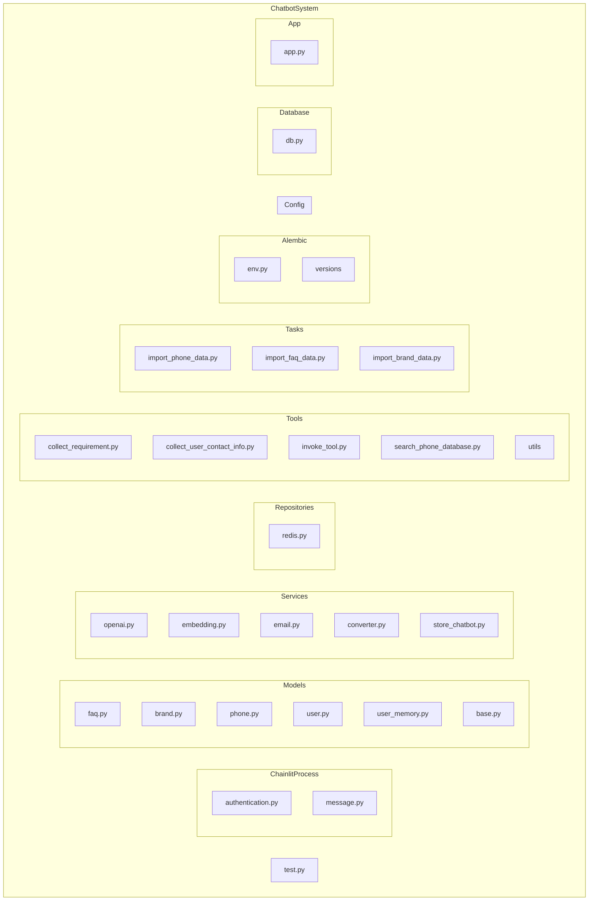

## Architecture Diagram

To render this diagram (Mermaid syntax), you can:
-   Use the links below to open it in Mermaid Live Editor, or
-   Install the [Markdown Preview Mermaid Support](https://marketplace.visualstudio.com/items?itemName=bierner.markdown-mermaid) extension.

For any issues or feature requests, please visit our [GitHub repository](https://github.com/swark-io/swark) or email us at contact@swark.io.

## Generated Content
**Model**: GPT 4o - [Change Model](vscode://settings/swark.languageModel)  
**Mermaid Live Editor**: [View](https://mermaid.live/view#pako:eNqNVE1P5DAM_SujnNH-gLmtmCsS2uFYqXITt7Vo4pC4I40Q_31NywqmCWxziz_fe3H8aiw7NEfThCFBHA9PpyYc9OS5Ww33I0jHcr5mQb_6tn4KE8ljYos5f0a8H5hlxCBkQYjDr3i9dXtNgAFv7BhcpcuDopw2xXt42VXx_XQJgiusceRQxs4ZU9XYevScrmVxyHs4nDFdSDW6TeaIAaioib5D5ygMFQ_QVFgthwsmqSDPwglbuz7jDph_MHImTaIt1LqItWeoSlhXO6GjvFvuOuQn5u1wWJ4mtNImfJkpodcprGi2xizNVEABvVDoeRdHChd-xla0d6k5QrJjuzBuHQgUI7KQFPoK-xtukJ833MhHTvKleoltjVDYP_qXBy0j6kB-TzqTZDfDGC5FcZ3DrL_9v8zuOfQ0_Fyvnnn6UPQ213V7WMS4WVExfp8mmD_HZvGYO-Mx6Rd0ujRfG6P7zWNjjofGOOxhnqQxbxo0R5UVTwTa1pujpBnvjK5DPl-D_XdPPA-jOfYwZXz7C716kFQ) | [Edit](https://mermaid.live/edit#pako:eNqNVE1P5DAM_SujnNH-gLmtmCsS2uFYqXITt7Vo4pC4I40Q_31NywqmCWxziz_fe3H8aiw7NEfThCFBHA9PpyYc9OS5Ww33I0jHcr5mQb_6tn4KE8ljYos5f0a8H5hlxCBkQYjDr3i9dXtNgAFv7BhcpcuDopw2xXt42VXx_XQJgiusceRQxs4ZU9XYevScrmVxyHs4nDFdSDW6TeaIAaioib5D5ygMFQ_QVFgthwsmqSDPwglbuz7jDph_MHImTaIt1LqItWeoSlhXO6GjvFvuOuQn5u1wWJ4mtNImfJkpodcprGi2xizNVEABvVDoeRdHChd-xla0d6k5QrJjuzBuHQgUI7KQFPoK-xtukJ833MhHTvKleoltjVDYP_qXBy0j6kB-TzqTZDfDGC5FcZ3DrL_9v8zuOfQ0_Fyvnnn6UPQ213V7WMS4WVExfp8mmD_HZvGYO-Mx6Rd0ujRfG6P7zWNjjofGOOxhnqQxbxo0R5UVTwTa1pujpBnvjK5DPl-D_XdPPA-jOfYwZXz7C716kFQ)

